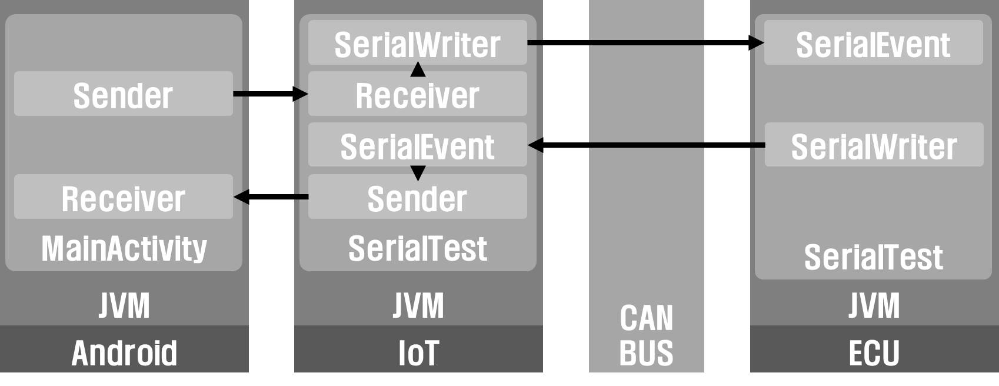

# SimpleCanComm

## Introduction

- This Repository is for communication system among Android, IoT, CAN

## SYSTEM ARCH

- System Archtecture

- Android : [ServerIoTCommunicationExercise](/ServerIoTCommunicationExcerise)
  - MainActivity.java
    - ConnectServerTask
      - This Class is for communication task with computer server for test
    - ConnectIoTTask
      - This Class is for communication task with IoT device

- LattePanda : [can](/can)
  - SerialTestS.java
    - SerialWriter
      - Send the data using can bus to IoT device
    - SerialEvent
      - Receive the data using can bus from IoT device
    - Sender
      - Send the data using socket to Android Platform
    - Receiver
      - Receive the data using socket from Android Platform

- LattePanda : [CAN](/CAN)
  - SerialTest.java
    - SerialWriter
      - Send the data using can bus to IoT device
    - SerialEvent
      - Receive the data using can bus from IoT device

## Format

- CAN BUS

  - Send

  

  

  - Receive

  
